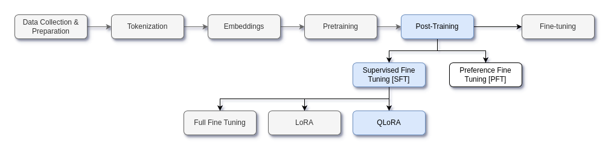

# Supervised Fine Tuning



- In this project, a pre-trained Microsoft Phi 2 model is used for post-training
- Pre-training a model is a very long and expensive process
- Usually, the model is trained on a large datasets for various days to months
- Pre-trained model can generate the next token but they don't know when to stop generation, how to answer questions, etc
- In order to give chatting capabilities to the mode, post-training is done
- Post-training consists of two parts:
  - Supervised Fine Tuning (SFT) - Training the model on curated, instruction-based data.
  - Preference Fine Tuning (PFT)  - Training the model to align better with human preference
- SFT can be performed in one of the three ways:
  - Full fine tuning
  - Low Rank Adaptation (LoRA)
  - Quantized Low Rank Adaptation (QLoRA)

- In this project, QLoRA is used for fine tuning on OpenAssistant dataset


---


## Dataset

- [OpenAssistant dataset](https://huggingface.co/datasets/OpenAssistant/oasst1?row=0)
- OpenAssistant Conversations (OASST1), a human-generated, human-annotated assistant-style conversation corpus consisting of **161,443 messages** in **35 different languages**, annotated with 461,292 quality ratings, resulting in over **10,000 fully annotated conversation trees**. 
- The corpus is a product of a worldwide crowd-sourcing effort involving over 13,500 volunteers.
- Below is the data sample from the dataset

```
Sample 7:

Raw Input: Instruct: Suggest 10 topics for a research proposal, all topics must have managerial relevance in the scope of international business. Topics must also consist of one dependent variable, one independent variable, and two moderator variables.

Output: Here are ten topics for research proposals:
1: The effect of cultural intelligence (independent variable) on cross-cultural communication (dependent variable), moderated by language proficiency and intercultural experience (moderator variables).
2: The impact of corruption (independent variable) on foreign market entry strategies (dependent variable), moderated by the institutional environment and ownership structure (moderator variables).
3: The relationship between transformational leadership (independent variable) and employee job satisfaction (dependent variable), moderated by cultural values and organizational culture (moderator variables).
4: The influence of corporate social responsibility (independent variable) on firm performance (dependent variable), moderated by industry competitiveness and government regulations (moderator variables).
5: The effect of digital transformation (independent variable) on supply chain management performance (dependent variable), moderated by IT infrastructure and human capital development (moderator variables).
6: The impact of cultural distance (independent variable) on expatriate adjustment (dependent variable), moderated by social support and family situation (moderator variables).
7: The relationship between knowledge transfer (independent variable) and innovation performance (dependent variable), moderated by absorptive capacity and R&D investment (moderator variables).
8: The influence of cross-cultural marketing (independent variable) on customer loyalty (dependent variable), moderated by consumer ethnocentrism and brand reputation (moderator variables).
9: The effect of international human resource management practices (independent variable) on expatriate retention (dependent variable), moderated by cultural distance and career development opportunities (moderator variables).
10: The impact of political risk (independent variable) on foreign direct investment (dependent variable), moderated by market entry mode and host country location (moderator variables).

Input Tokens: tensor([43993,    25, 35042,  ..., 50256, 50256, 50256])

Output Tokens: tensor([ -100,  -100,  -100,  ..., 50256, 50256, 50256])

Attention Mask: tensor([1, 1, 1,  ..., 0, 0, 0])
```


---


## Model

https://huggingface.co/microsoft/phi-2


---


## Setup

### Requirements
- Python 3.8+
- PyTorch 2.0+
- Transformers 4.30+
- PEFT (Parameter-Efficient Fine-Tuning)
- Accelerate
- bitsandbytes (for quantization)
- datasets


### Installation
```bash
git clone https://github.com/Shilpaj1994/SFT-with-QLoRA.git
```


### Environment Setup

```bash
python -m venv sft-env
source sft-env/bin/activate # On Windows: sft-env\Scripts\activate
pip install -r requirements.txt
```


### Dataset Preparation

The OpenAssistant dataset will be automatically downloaded through the Hugging Face datasets library. The dataset preparation is handled in `dataset.py`, which processes the conversations into a suitable format for instruction fine-tuning.


### Configuration

Edit the `config.py` file to customize your training parameters:
- Model name/path
- LoRA configurations (rank, alpha, dropout)
- Training hyperparameters (learning rate, batch size, etc.)
- Quantization parameters

Use `ds_config.json` for DeepSpeed configuration if training on multiple GPUs.


---


## Training

### Running the Training
To start the fine-tuning process with QLoRA:
```bash
python training.py --max_epochs 1 --save_adapters_only
```


### Output

After training, the following artifacts will be produced:
- Full model checkpoint
- LoRA adapters that can be loaded separately
- Training logs and metrics


---


## Inference

```bash
python inference.py --model_path ./adapters --base_model microsoft/phi-2 --use_qlora --example_prompts
```


---


## Try it out!

App is hosted on Hugging Face Spaces. Click the link below to try it out!

[Supervised Fine Tuned (SFT) Phi-2 with QLoRA Adapters](https://huggingface.co/spaces/Shilpaj/SFT-Phi2-QLoRA)


