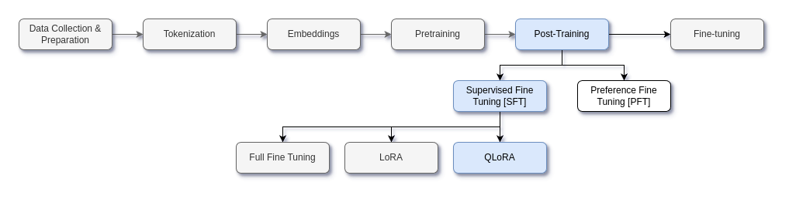

# Supervised Fine-Tuning

- In this project, a pre-trained Microsoft Phi 2 model is used for post-training
- Pre-training a model is a very long and expensive process
- Usually, the model is trained on a large datasets for various days to months
- Pre-trained model can generate the next token but they don't know when to stop generation, how to answer questions, etc
- In order to give chatting capabilities to the mode, post-training is done
- Post-training consists of two parts:
  - Supervised Fine Tuning (SFT) - Training the model on curated, instruction-based data.
  - Preference Fine Tuning (PFT)  - Training the model to align better with human preference
- SFT can be performed in one of the three ways:
  - Full fine tuning
  - Low Rank Adaptation (LoRA)
  - Quantized Low Rank Adaptation (QLoRA)

---

### Full Fine-Tuning

Full fine-tuning means **updating all the parameters** of a pre-trained model during training. Unlike **LoRA or QLoRA**, where only a small subset of parameters are modified, full fine-tuning requires modifying and storing **every weight and gradient**, making it **the most resource-intensive approach**.

#### **How Full Fine-Tuning Works**

1. **Load the Pre-Trained Model**
   - Start with a large model like GPT-4, Llama 2, or a vision-language model.
2. **Unfreeze All Parameters**
   - Unlike LoRA (which freezes most parameters), full fine-tuning allows every weight in the model to be updated.
3. **Train on New Data**
   - The model is trained on a domain-specific dataset, allowing it to adapt to **new tasks, styles, or languages**.
4. **Store Updated Model**
   - After training, a completely new model is saved, requiring a lot of storage.

#### **Advantages of Full Fine-Tuning**

✅ **Best Performance** – Achieves the highest level of customization and adaptation.
 ✅ **No Need for Adapters** – No need for LoRA or extra adapter layers.
 ✅ **Good for Small Models** – Works well if the model is relatively small (e.g., <1B parameters).

#### **Disadvantages of Full Fine-Tuning**

❌ **Extremely Expensive** – Requires **high-end GPUs (A100, H100, TPU)** with **hundreds of GBs of VRAM**.
 ❌ **Slower Training** – Fine-tuning all weights means longer training times.
 ❌ **Storage Issues** – Needs to store a full set of new weights, unlike LoRA, which stores only small weight updates.
 ❌ **Risk of Overfitting** – If the dataset is small, the model may memorize it rather than generalizing.

---

### LoRA

LoRA is a technique used to **fine-tune large models efficiently** by introducing trainable low-rank matrices into specific layers, rather than modifying all model parameters. It significantly **reduces memory usage and computational cost** while achieving performance comparable to full fine-tuning.

- **How it works:**
  - Instead of updating the entire weight matrix WWW, LoRA decomposes it into two smaller trainable matrices AAA and BBB of lower rank.
  - The update is then represented as W′=W+ΔWW' = W + \Delta WW′=W+ΔW, where ΔW=A×B\Delta W = A \times BΔW=A×B.
  - Since AAA and BBB have a lower rank, this drastically reduces the number of parameters to train.
- **Advantages:**
  - Uses significantly less VRAM (GPU memory).
  - Enables efficient fine-tuning of **large language models (LLMs)** on consumer GPUs.
  - Avoids catastrophic forgetting by keeping the original model weights frozen.

---

### QLoRA

QLoRA is an extension of LoRA that **further reduces memory requirements** by using **4-bit quantization** on the base model while still applying LoRA for fine-tuning. This allows even larger models (like **LLama 2-65B**) to be fine-tuned on a **single GPU**.

- **How it works:**
  1. **Quantization:** The base model is loaded in a **low-bit representation (e.g., 4-bit NormalFloat - NF4)**, drastically reducing memory usage.
  2. **LoRA Adaptation:** Fine-tuning is done using LoRA adapters, ensuring only small updates are stored while keeping the quantized weights unchanged.
  3. **Dequantization (Optional):** During inference, the model can be dequantized or used as is.
- **Advantages:**
  - Reduces GPU RAM requirements by **2-4x compared to LoRA**.
  - Enables fine-tuning **very large models (e.g., 30B+ parameters) on a single A100 GPU**.
  - Maintains performance close to full-precision fine-tuning.

---

### Comparison

| **Method**           | **Memory Usage**                    | **Performance**       | **Training Speed** | **Best Use Case**                                            |
| -------------------- | ----------------------------------- | --------------------- | ------------------ | ------------------------------------------------------------ |
| **Full Fine-Tuning** | Very High (100s of GBs)             | Best                  | Slowest            | When you need **maximum customization** and have powerful hardware. |
| **LoRA**             | Medium (10-30% of full fine-tuning) | Near full fine-tuning | Faster             | Fine-tuning on a **single GPU** with moderate VRAM.          |
| **QLoRA**            | Lowest (uses 4-bit quantization)    | Close to LoRA         | Fastest            | **Fine-tuning massive models (30B+ params) on consumer GPUs**. |

---

### Interesting Advances

After LoRA (2021) and QLoRA (2023), we haven't seen anything revolutionary that's entirely new in the PEFT space, but we have seen a few important refinements, combinations, and trends worth noting:

- **LoRA + Mixture of Experts (2024 trend):** Combina LoRA with MoE. Instead of training one fixed adapter per task, you train a pool of many small experts, each low-rand, and dynamically select which ones to active for each input!
- **LayerDrop + LoRA (Sparse PEFT):** Instead of inserting LoRA into every attention layer, you adapt only a few key layers (middle layers tend to capture semantic meaning, early layer mostly process surface features [syntax], final layers focus on task-specific adaptation. One interesting approach is "LoRA Lottery Ticket" Search. Train LoRA on all layers briefly. Prune LoRA adapters from layers where LoRA weights stay close to zero. Eat Ice Cream. 
- LoRA Fusion. Train multiple adapters trained for different tasks like legal, finance, customer support. Then use all together and get your own McKinsey guy!